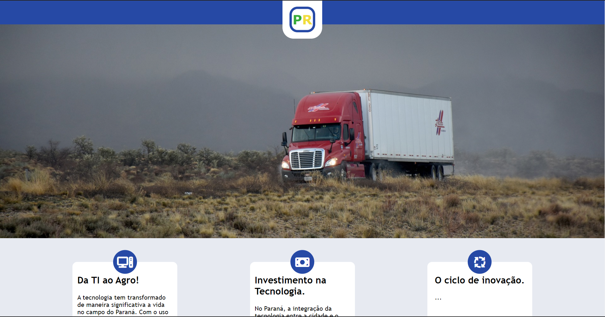
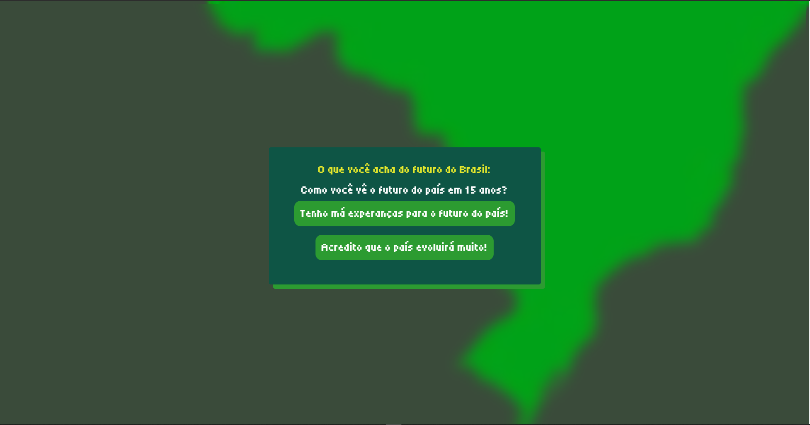

  
  # Witor Tenã

**`💻 Front-End Developer`**

I'm a Brazilian web developer, I was introduced to coding when I was young, when I had the opportunity to try Python for the first time, I loved rendering my first "Hello World!" in the console and since then I can't stop learning.
Now it's not only a habit, but also my mission, to code every idea I have and gain as much knowledge as I can from this ever-growing World Wide Web...

  
## My Languages and Tools

> [!NOTE]
> Useful information that users should know, even when skimming content.

 
 

  
## Some of my Projects:

<a href="https://reactthreefiberdemo.netlify.app/">3D Demo</a>

<a href="https://witordev.github.io/react-todo-app/">To-Do WebApp</a>

<a href="https://witordev.github.io/Projeto-Agrinho/">Project Agrinho</a>

<a href="https://witordev.github.io/Escolhas/">Brazil's choices for the future</a>

</ul>

## Get in touch

✉ Email: <a href="mailto:witortenadev@gmail.com">witortenadev@gmail.com</a>

📞 Phone | Whatsapp: +55 43 98413-8592

